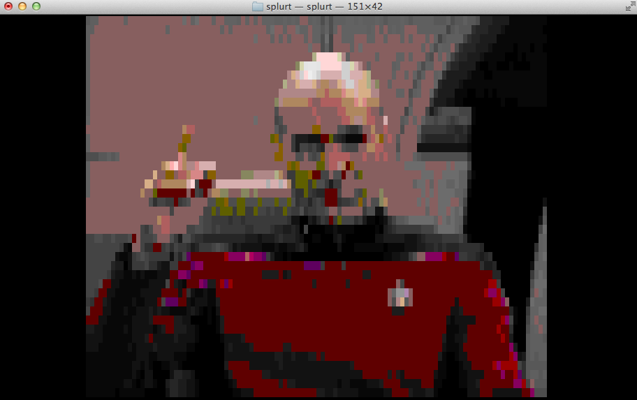

# splurt
The Useless Terminal Jpeg Viewer

splurt draws a jpeg image directly into your terminal.

splurt requires a 256-color compatible terminal emulator

## Usage

Just run `splurt path/to/image.jpg` and behold the splendor.

## Build

Splurt uses cmake and requires libjpeg and ncurses.

First: `cmake .`
Then: `make`

## License

Copyright (C) 2012 Ryan Crum

Distributed under the MIT License.

